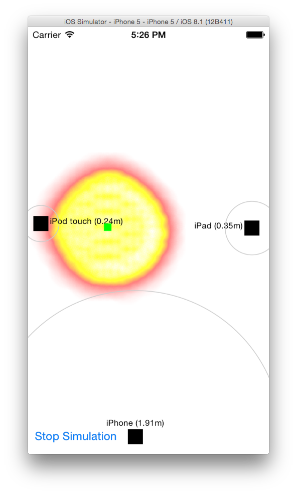

# Beacons Positioning

This repo contains some pieces that try to solve the problem of indoor positioning: locating a device inside a room using 3 or more beacons.

## Client

The iOS client is an app that initially puts some beacons on the screen and can perform the following actions.

### Range beacons

Touching and dragging near the beacon will move it position. On the settings panel you can configure the room size and the beacons details. Tap 'Start Ranging' to visualize your position in the room.

### Logs

Each time you start ranging, the session will be logged. By accessing the logs panel you can select a log to re-play the session or swipeleft to delete it.

### Estimation

In order to calculate the estimated position, the app uses different methods as well as a noise filter based on past measures.

To calculate the estimated position (x, y) two options are available: a non-linear optimization method called [Levenberg Marquadt](http://eigen.tuxfamily.org/dox/unsupported/classEigen_1_1LevenbergMarquardt.html) and an ad-hoc heuristic method based on searching the whole room for the position where measurement error is minimum. The method can be changed from the settings panel.

### Heatmap

Since the real position of the device in a room is quite hard to figure out due to signal noise and attenuation, it's more realistic to draw a heatmap of last measured positions. This way you can have a probability area of your position. You can enable the heatmap from the settings panel.

## Server

In the Server/ directory you can find an old piece that was used as a receptor that received beacons signals and transmit them through an Socket.IO API. The server can run on a computer that has Bluetooth LE.

### Attributions

Written by [Luis Floreani](https://github.com/lucholaf), sponsored by [Citrusbyte](https://citrusbyte.com/)

## About Citrusbyte

This software is lovingly maintained and funded by Citrusbyte.
At Citrusbyte, we specialize in solving difficult computer science problems for startups and the enterprise.

At Citrusbyte we believe in and support open source software.
* Check out more of our open source software at Citrusbyte Labs.
* Learn more about [our work](https://citrusbyte.com/portfolio).
* [Hire us](https://citrusbyte.com/contact) to work on your project.
* [Want to join the team?](http://careers.citrusbyte.com)

*Citrusbyte and the Citrusbyte logo are trademarks or registered trademarks of Citrusbyte, LLC.*
